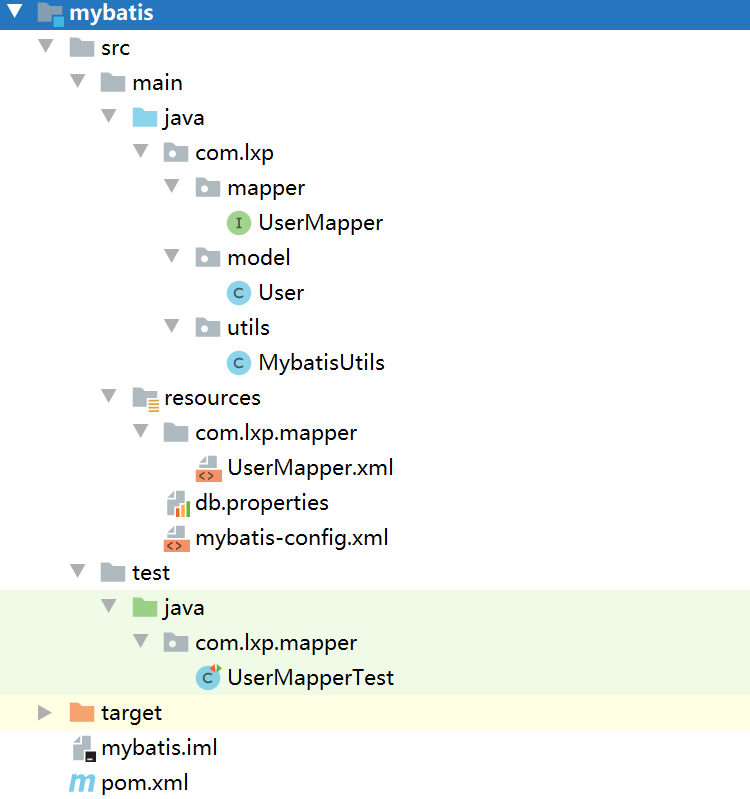

# 0、项目结构图



# 一、建库建表

```sql
CREATE DATABASE `mybatis`;
USE `mybatis`;
DROP TABLE IF EXISTS `user`;
CREATE TABLE `user` (
`id` int(20) NOT NULL AUTO_INCREMENT,
`name` varchar(20) DEFAULT NULL,
`pwd` varchar(40) DEFAULT NULL,
PRIMARY KEY (`id`)
) ENGINE=InnoDB DEFAULT CHARSET=utf8;
insert  into `user`(`id`,`name`,`pwd`) values (1,'小明','123456'),(2,'张三','abcdef'),(3,'李四','987654');
```

# 二、pom.xml引入依赖

```xml
<?xml version="1.0" encoding="UTF-8"?>
<project xmlns="http://maven.apache.org/POM/4.0.0"
         xmlns:xsi="http://www.w3.org/2001/XMLSchema-instance"
         xsi:schemaLocation="http://maven.apache.org/POM/4.0.0 http://maven.apache.org/xsd/maven-4.0.0.xsd">
    <modelVersion>4.0.0</modelVersion>

    <groupId>com.lxp</groupId>
    <artifactId>mybatis</artifactId>
    <version>1.0-SNAPSHOT</version>


    <properties>
        <maven.compiler.target>1.8</maven.compiler.target>
        <maven.compiler.source>1.8</maven.compiler.source>
    </properties>

    <dependencies>

        <!--mysql驱动-->
        <dependency>
            <groupId>mysql</groupId>
            <artifactId>mysql-connector-java</artifactId>
            <version>8.0.21</version>
        </dependency>

        <!--mybatis-->
        <dependency>
            <groupId>org.mybatis</groupId>
            <artifactId>mybatis</artifactId>
            <version>3.5.6</version>
        </dependency>

        <!--junit-->
        <dependency>
            <groupId>junit</groupId>
            <artifactId>junit</artifactId>
            <version>4.13</version>
        </dependency>
    </dependencies>

    <!--在build中配置resource，来防止我们资源到处失败的问题-->
    <build>
        <resources>
            <resource>
                <directory>src/main/resources</directory>
                <includes>
                    <include>**/*.properties</include>
                    <include>**/*.xml</include>
                </includes>
                <filtering>true</filtering>
            </resource>
            <resource>
                <directory>src/main/java</directory>
                <includes>
                    <include>**/*.properties</include>
                    <include>**/*.xml</include>
                </includes>
                <filtering>true</filtering>
            </resource>
        </resources>
    </build>
</project>
```
# 三、编写配置文件

## 1.Mybatis核心配置文件

*mybatis-config.xml*

```xml
<?xml version="1.0" encoding="UTF-8" ?>
<!DOCTYPE configuration
        PUBLIC "-//mybatis.org//DTD Config 3.0//EN"
        "http://mybatis.org/dtd/mybatis-3-config.dtd">
<configuration>


    <!--引入外部配置文件-->
    <properties resource="db.properties"/>

    <typeAliases>
        <typeAlias type="com.lxp.model.User" alias="user"/>
    </typeAliases>


    <environments default="development">

        <environment id="development">
            <transactionManager type="JDBC"/>
            <dataSource type="POOLED">
                <property name="driver" value="${driver}"/>
                <property name="url" value="${url}"/>
                <property name="username" value="${username}"/>
                <property name="password" value="${password}"/>
            </dataSource>
        </environment>


    </environments>

    <mappers>
        <mapper resource="com/lxp/mapper/UserMapper.xml"/>
    </mappers>


</configuration>
```

## 2.数据源配置文件

*db.properties*

```properties
driver=com.mysql.cj.jdbc.Driver
url=jdbc:mysql://localhost:3306/mybatis?serverTimezone=UTC&useSSL=true&useUnicode=true&characterEncoding=UTF-8
username=root
password=root
```

# 四、编写Java测试类

## 1、编写Mybatis工具类

*MybatisUtils*

```java
package com.lxp.utils;

import org.apache.ibatis.io.Resources;
import org.apache.ibatis.session.SqlSession;
import org.apache.ibatis.session.SqlSessionFactory;
import org.apache.ibatis.session.SqlSessionFactoryBuilder;

import java.io.IOException;
import java.io.InputStream;

public class MybatisUtils {

    private static SqlSessionFactory sqlSessionFactory;

    static {
        try {
            //使用Mybatis第一步: 获取sqlSessionFactory对象
            String      resource    = "mybatis-config.xml";
            InputStream inputStream = Resources.getResourceAsStream(resource);
            sqlSessionFactory = new SqlSessionFactoryBuilder().build(inputStream);
        } catch (IOException e) {
            e.printStackTrace();
        }
    }


    //既然有了 SqlSessionFactory，顾名思义，我们可以从中获得 SqlSession 的实例。
    //sqlSession 完全包含了面向数据库执行SQL命令所需的所有方法
    public static SqlSession getSqlseesion() {
        // SqlSession sqlSession = sqlSessionFactory.openSession();
        return sqlSessionFactory.openSession();
    }
}
```
## 2、编写User实体类

```java
public class User {
   private int id;  //id
   private String name;   //姓名
   private String pwd;   //密码
   public int getId() {
      return id;
   }
   public void setId(int id) {
       this.id = id;
   }
   public String getName() {
       return name;
   }
   public void setName(String name) {
       this.name = name;
   }
   public String getPwd() {
       return pwd;
   }
   public void setPwd(String pwd) {
       this.pwd = pwd;
   }
   @Override
   public String toString() {
       return "User{" +
               "id=" + id +
               ", name='" + name + '\'' +
               ", pwd='" + pwd + '\'' +
               '}';
   }  
}
```
## 3、编写UserMapper接口

```java
package com.lxp.mapper;

import com.lxp.model.User;

import java.util.List;
public interface UserMapper {
   //查询全部用户
   List<User> getUserList();
}
```
## 4、编写UserMapper对应的xml文件

```xml
<?xml version="1.0" encoding="UTF-8" ?>
<!DOCTYPE mapper
        PUBLIC "-//mybatis.org//DTD Mapper 3.0//EN"
        "http://mybatis.org/dtd/mybatis-3-mapper.dtd">

<mapper namespace="com.lxp.mapper.UserMapper">
    <select id="getUserList" resultType="com.lxp.model.User">
        select * from mybatis.user
    </select>
</mapper>
```
## 5、编写测试类

```java
package com.lxp.mapper;

import com.lxp.model.User;
import com.lxp.utils.MybatisUtils;
import org.apache.ibatis.session.SqlSession;
import org.junit.Test;

import java.util.List;

public class UserMapperTest {

    @Test
    public void test() {
        SqlSession sqlSession = MybatisUtils.getSqlseesion();
        UserMapper    userMapper  = sqlSession.getMapper(UserMapper.class);
        List<User> userList = userMapper.getUserList();
        for(User user : userList){
            System.out.println(user);
        }
        sqlSession.close();
    }
}

```

## 6、遇到的问题,资源无法导入（maven由于他的约定大于配置，可能遇到写的配置文件无法导出或生效的题），解决方案

```xml
<!--在build中配置resource，来防止我们资源到处失败的问题-->
    <build>
        <resources>
            <resource>
                <directory>src/main/resources</directory>
                <includes>
                    <include>**/*.properties</include>
                    <include>**/*.xml</include>
                </includes>
                <filtering>true</filtering>
            </resource>
            <resource>
                <directory>src/main/java</directory>
                <includes>
                    <include>**/*.properties</include>
                    <include>**/*.xml</include>
                </includes>
                <filtering>true</filtering>
            </resource>
        </resources>
    </build>
```

